# 프로젝트 구조 문서화

이 문서는 Nuxt.js 기반의 프로젝트 구조와 주요 구성 요소에 대한 상세 설명을 제공합니다.

## 1. 개요

이 프로젝트는 Nuxt.js (Vue 3, Pinia, Tailwind CSS 포함)를 기반으로 구축된 웹 애플리케이션입니다. Prisma를 사용하여 데이터베이스를 관리하며, Supabase를 백엔드 서비스로 활용합니다. 프론트엔드와 백엔드 API가 Nuxt.js 내에서 통합되어 있습니다.

## 2. 프로젝트 최상위 구조

```
nuxt-project/
├── app.vue
├── assets/
├── components/
├── composables/
├── constants/
├── directives/
├── layouts/
├── middleware/
├── nuxt.config.ts
├── package.json
├── pages/
├── plugins/
├── prisma/
├── public/
├── server/
├── stores/
├── tailwind.config.js
└── utils/
```

## 3. 주요 구성 요소 상세 설명

### 3.1. Frontend (클라이언트 측)

Nuxt.js의 클라이언트 측 애플리케이션을 담당하며, 사용자 인터페이스와 상호작용 로직을 포함합니다.

*   **`pages/`**:
    *   Nuxt.js 라우팅 시스템에 따라 URL 경로에 매핑되는 Vue 컴포넌트들입니다.
    *   `/adminpage/`, `/blog/`, `/board/`, `/gallery/`, `/youtube-gallery/` 등 다양한 기능별 페이지를 포함합니다.
    *   `/adminpage/database.vue` 및 새로 생성된 `/adminpage/db-backup-restore.vue`와 같이 특정 관리 기능 페이지도 포함됩니다.
*   **`components/`**:
    *   애플리케이션 전반에서 재사용 가능한 Vue 컴포넌트들을 모아둔 디렉토리입니다.
    *   `common/`: 모달, 토스트, 드롭다운 메뉴 등 공통적으로 사용되는 UI 컴포넌트.
    *   `admin/`, `blog/`, `board/`, `gallery/`, `youtubeGallery/`, `home/`, `wiki/` 등 기능별로 컴포넌트가 조직화되어 있습니다.
*   **`layouts/`**:
    *   페이지의 전체적인 구조와 레이아웃을 정의하는 Vue 컴포넌트입니다.
    *   `default.vue`, `admin.vue`, `blog.vue` 등 여러 레이아웃을 정의하여 각 페이지에 적용할 수 있습니다. `admin.vue`는 관리자 페이지의 사이드바 메뉴 등을 포함합니다.
*   **`composables/`**:
    *   Vue 3 Composition API를 사용하여 재사용 가능한 로직(상태 관리, 비동기 호출 등)을 캡슐화한 함수들입니다.
    *   `useAuth.js`, `useYoutubeGallery.js`, `useToast.js` 등이 여기에 포함됩니다.
*   **`stores/`**:
    *   Pinia를 사용하여 애플리케이션 전역 상태를 관리하는 모듈들입니다.
    *   `categoryStore.js`, `menu.js`, `navStore.js` 등 특정 데이터나 UI 상태를 저장합니다.
*   **`assets/`**:
    *   글로벌 CSS, 이미지, 폰트 등 정적 자산이 포함됩니다.
    *   `css/`: `main.css`, `calendar.css` 등 전역 스타일시트.

### 3.2. Backend (서버 측)

Nuxt.js의 서버 엔진을 활용하여 API 엔드포인트, 서버 유틸리티 및 미들웨어를 제공합니다.

*   **`server/api/`**:
    *   Nuxt.js의 서버 라우터에 의해 자동으로 API 엔드포인트로 노출되는 파일들입니다.
    *   `admin/`: 관리자 페이지에서 사용되는 API 엔드포인트 (예: `db/`, `gallery/`, `youtube-gallery/`, `users/` 등). 최근 구현된 DB 백업/복구 API (`backup.post.js`, `restore.post.js`, `backups.get.js`, `download/[filename].get.js`)가 여기에 위치합니다.
    *   `blogPosts/`, `boardPosts/`, `gallery/`, `youtube-categories/` 등 각 기능에 대한 공개 API 엔드포인트도 포함됩니다.
*   **`server/utils/`**:
    *   서버 측 API 로직에서 공통적으로 사용되는 유틸리티 함수들입니다.
    *   `auth.js`: 인증 및 권한 부여 관련 헬퍼 함수.
    *   `dbBackupUtils.js`: DB 백업을 위한 SQL 생성 로직.
    *   `dbRestoreUtils.js`: DB 복원을 위한 SQL 실행 로직.
    *   `prisma.js`: Prisma 클라이언트 인스턴스.
*   **`middleware/`**:
    *   클라이언트 또는 서버 라우트가 렌더링되기 전에 실행되는 함수들입니다.
    *   `admin-auth.js`: 관리자 페이지 접근 권한을 확인.
    *   `auth.global.js`: 전역 인증 처리.
*   **`plugins/server/`**:
    *   Nuxt.js 서버 사이드에서만 실행되는 플러그인들입니다.
    *   `initialize-categories.server.js`: 서버 시작 시 카테고리 초기화 등.

### 3.3. Database (데이터베이스)

데이터베이스 스키마 정의, 마이그레이션 관리 및 관련 파일들을 포함합니다.

*   **`prisma/`**:
    *   Prisma ORM과 관련된 파일들이 있습니다.
    *   `schema.prisma`: 데이터베이스 스키마를 정의하는 파일입니다. 모든 데이터 모델(테이블)과 그 관계가 여기에 정의됩니다.
    *   `migrations/`: Prisma Migrate를 통해 생성된 데이터베이스 스키마 변경 이력 파일들이 저장됩니다.
*   **`public/backups/`**:
    *   데이터베이스 백업 기능에 의해 생성된 SQL 백업 파일들이 저장되는 디렉토리입니다. `.gitignore`에 의해 Git 추적에서 제외됩니다.
*   **`public/uploads/`**:
    *   사용자가 업로드한 파일(예: 이미지)이 저장되는 디렉토리입니다.

### 3.4. Configuration & Utilities (설정 및 유틸리티)

프로젝트 전반에 걸쳐 사용되는 설정 파일 및 기타 유틸리티 스크립트입니다.

*   **`nuxt.config.ts`**:
    *   Nuxt.js 애플리케이션의 핵심 설정 파일입니다. 모듈, 플러그인, 빌드 설정, 런타임 환경 변수 등이 정의됩니다.
*   **`package.json` / `package-lock.json`**:
    *   프로젝트의 메타데이터, 스크립트, 개발 및 배포 의존성 패키지 목록을 정의합니다.
*   **`tailwind.config.js`**:
    *   Tailwind CSS의 사용자 정의 설정 파일입니다. 테마, 색상, 유틸리티 클래스 등을 확장하거나 재정의할 수 있습니다.
*   **`utils/`**:
    *   프론트엔드와 백엔드 모두에서 사용될 수 있는 공통 유틸리티 함수들입니다.
    *   `dateFormatter.js`, `debounce.js` 등.
*   **`constants/`**:
    *   애플리케이션 전반에서 사용되는 상수 값들을 정의하는 파일입니다.
*   **`directives/`**:
    *   Vue의 사용자 정의 디렉티브를 정의하는 파일입니다.

## 4. 프로젝트 구조 다이어그램 (Mermaid)

```mermaid
graph TD
    A[Nuxt.js Project] --> B(Frontend)
    A --> C(Backend)
    A --> D(Database)
    A --> E(Configuration & Utilities)

    B --> B1[pages/]
    B --> B2[components/]
    B --> B3[layouts/]
    B --> B4[composables/]
    B --> B5[stores/]
    B --> B6[assets/]

    C --> C1[server/api/]
    C --> C2[server/utils/]
    C --> C3[middleware/]
    C --> C4[plugins/server/]

    D --> D1[prisma/]
    D --> D2[public/backups/]
    D --> D3[public/uploads/]

    E --> E1[nuxt.config.ts]
    E --> E2[package.json]
    E3[tailwind.config.js]
    E --> E4[utils/]
    E --> E5[constants/]
    E --> E6[directives/]

    B1 --- B1_1[Admin Pages]
    B1 --- B1_2[Blog Pages]
    B1 --- B1_3[Board Pages]
    B1 --- B1_4[Gallery Pages]
    B1 --- B1_5[YouTube Gallery Pages]
    B1 --- B1_6[Other Pages]

    B2 --- B2_1[Common Components]
    B2 --- B2_2[Admin Components]
    B2 --- B2_3[Blog Components]
    B2 --- B2_4[Board Components]
    B2 --- B2_5[Gallery Components]
    B2 --- B2_6[YouTube Gallery Components]

    C1 --- C1_1[Admin APIs]
    C1 --- C1_2[Public APIs]

    D1 --- D1_1[schema.prisma]
    D1 --- D1_2[migrations/]
``` 

